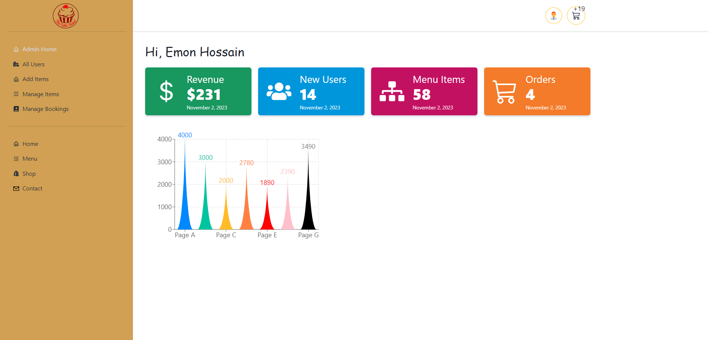
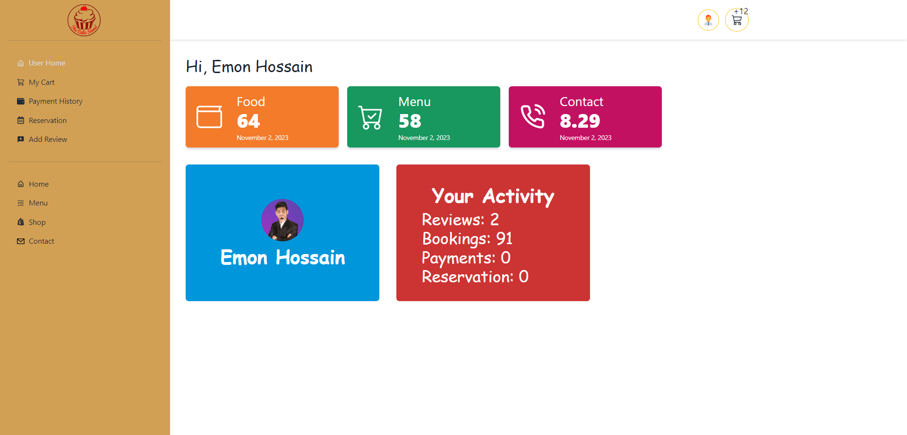
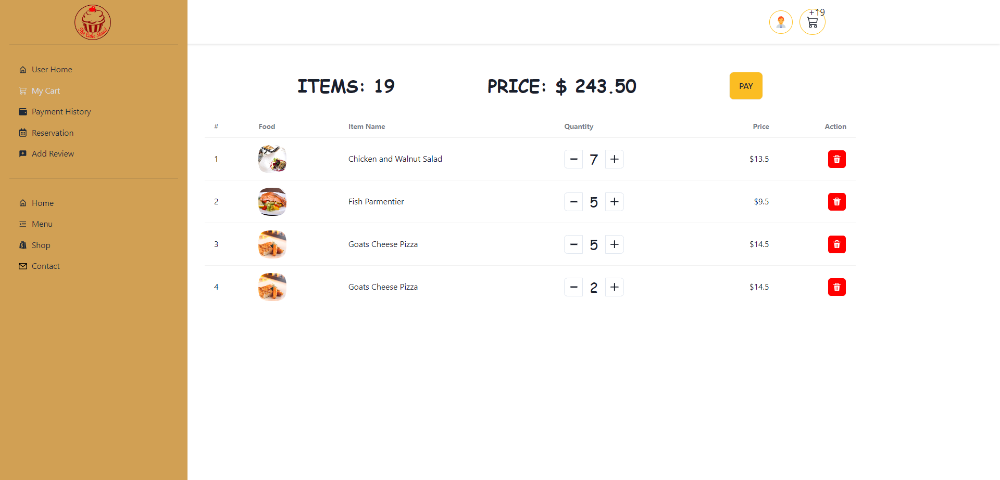
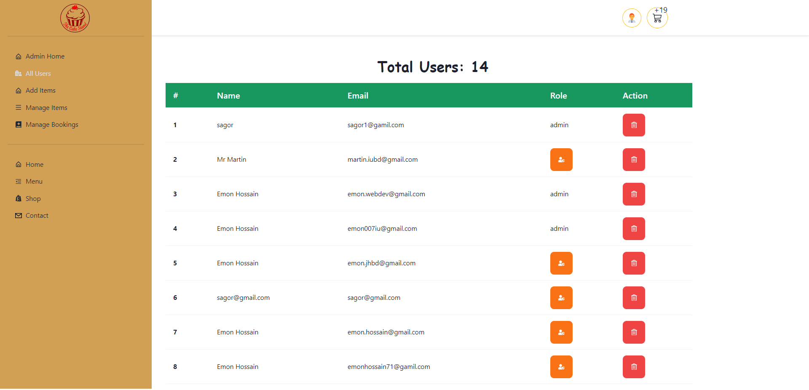
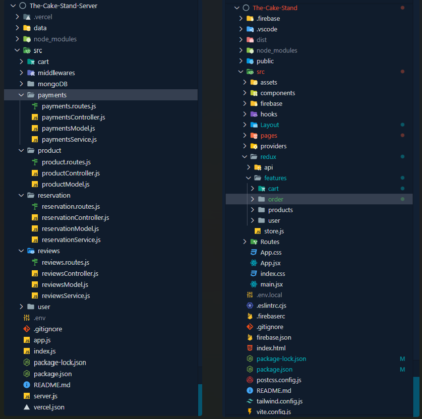

# Project Name : The-Cake-Stand

# Live Website

Live Website[https://the-cake-stand.web.app/](https://the-cake-stand.web.app/)  
Server URL[https://the-cake-stand-server.vercel.app/](https://the-cake-stand-server.vercel.app/)

Admin Email: <admin@gmail.com> 
Admin Password: <!1TCSAdmin>  
User Email: <user@gmail.com> 
User Password: <!1TCSUser>

# Technology & Package

- React & React Router
- Tailwind & Chakra UI
- Redux-Toolkit
- React-hook-form
- Axios & Tanstack-React-query
- Helmet-async & Firebase
- Tailwind & Chakra UI
- Date Fns, Recharts, Slick Carousel, Swiper, sweetalert2, eslint
-
- Node.js, Express.js
- MongoDb, Mongoose,

# What is works in this project

- This is a full-stack Restaurants Website website.
- Users need to login via Google (also can create a new Account).
- Have an Admin , User, User dashboard, Admin dashboard, Admin can delete, add, manage products etc...
- Dynamic Route
- Dynamic TESTIMONIALS
- Add a Single Product review
- Add a service review
- Backend data fetch
- categories products
- On clicking the Book now button
- Add A Food
- 404 page (not found page).
- User, Admin different route
- User, Admin Role set
  -Technology: React, Redux-Toolkit, Tailwind, MongoDB, Mongoose, Express.js, Node.js, Private route, 2 Type Role, Firebase Authentication, etc

### `Photo Gallery`

Runs the app in the development mode.\
Open [https://the-cake-stand.web.app/](https://the-cake-stand.web.app/) to view it in your browser.

#### Home Page

#### Admin Page

#### User Page

#### My Cart Page

#### All User Page

#### Project folder structure

